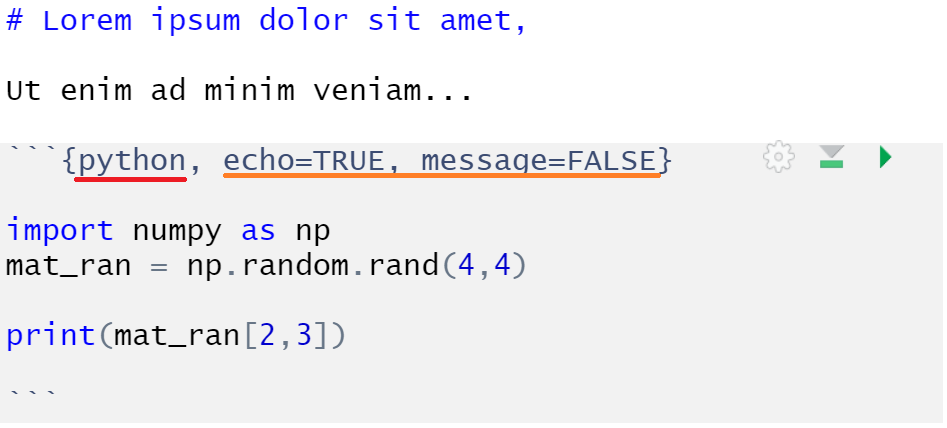

```{r setup, include=FALSE}
options(htmltools.dir.version = FALSE)
library(ggplot2)
library(plotly)
library(dplyr)
library(reticulate)
livedemosign <- function(top, left, deg) {
  htmltools::div("Live Demo!", class="faa-flash animated",
                 style=glue::glue("border:solid; border-color:black; position:absolute; top:{top}%; left:{left}%; font-size:36px; padding:4px; background-color:white; color:black;transform:rotate({deg}deg);")
                 )
}
```

layout: false
class: bg-lime split-30 hide-slide-number

.column[

]
.column.slide-in-right[.content.vmiddle[
.sliderbox.shade_main.pad1[
.font5[¡Bienvenidos!]
]
]]

---
class: hide-slide-number

# .teal[El mundo está cambiando y cambiara mas...]

<br>

### - Las aplicaciones y el análisis a los datos está en constante actualización

### - Para los analistas, es importante estar familiarizado con las prácticas adecuadas en su campo

### - El problema viene _siempre_ primero que las soluciones

---
class: middle center bg-lime hide-slide-number

# ¿Qué escojo?


---
layout: true
class: split-two with-thick-border border-white hide-slide-number

.column.bg-teal[.content[

<br>

# .white[.center[¿Por qué Python?]]

<br>

### - Lenguaje de propósito general con usos más allá del análisis de datos

### - Facilidad de despliegue de aplicaciones y productos informáticos

### - Alta legibilidad entre los lenguajes computacionales

<br>

.center[

]

]]    

.column.bg-light-blue[.content[

<br>

# .white[.center[¿Por qué R?]]

<br>

### - Lenguaje específico para Análisis estadístico

### - Vectorización es parte de su diseño i.e. Algebra Lineal

### - Alto número de paquetes de conocimiento especifico

<br>

.center[

]

]]
---
class: hide-col2
count:false

---
class:hide-col1
count:false

---
layout: false
class: middle center bg-lime hide-slide-number


---
class: bg-main6 hide-slide-number

# .center[Reticulate `r emo::ji("snake")`]

<br>

### - Paquete que conecta el ambiente de Python con R y viceversa

### - Objetos y funciones pueden ser traducidos y ser usados por ambos lenguajes

### - Personalizable en la versión de Python que se va usar

### - R Markdowns, cuadernos de Jupyter, todo con alto rendimiento inter-operativo

.center[

]

---
class: split-two with-thick-border border-white hide-slide-number    

.column.bg-teal[
.split-three[

.row[.content.vmiddle[


]]


.row[.content.vmiddle[

]]


.row[.content.vmiddle[


]]


]
]

.column.bg-light-blue[.content.vmiddle.center[

# .white[¡3 sencillos pasos!]

]]
---
class: split-two with-thick-border border-white hide-slide-number

.column.bg-teal[
.split-three[

.row[.content.vmiddle[

### - Instalar R y RStudio

]]


.row[.content.vmiddle[


]]


.row[.content.vmiddle[


]]


]
]

.column.bg-light-blue[.content.vmiddle.center[

# .white[¡3 sencillos pasos!]

]]

---
class: split-two with-thick-border border-white hide-slide-number    

.column.bg-teal[
.split-three[

.row[.content.vmiddle[

### - Instalar R y RStudio

]]


.row[.content.vmiddle[

### - Instalar `reticulate`

]]


.row[.content.vmiddle[

]]


]
]

.column.bg-light-blue[.content.vmiddle[

```{r, eval=FALSE}

install.packages("reticulate")
library(reticulate)

```


]]
---
class: split-two with-thick-border border-white hide-slide-number    

.column.bg-teal[
.split-three[

.row[.content.vmiddle[

### - Instalar R y RStudio

]]


.row[.content.vmiddle[

### - Instalar `reticulate`

]]


.row[.content.vmiddle[

### - Instalar `tidyverse`(recomendado)

]]


]
]

.column.bg-light-blue[.content.vmiddle[

```{r, eval=FALSE}
install.packages("tidyverse")
library(tidyverse)
```


]]

---
class: bg-main6 hide-slide-number

# Configuración de reticulate

### - `reticulate` tiene su propia instalación de Python que viene con Conda, si es que no detecta una versión de Python

### - Podemos especificar una variable global en el archivo .Renviron, localizado en el directorio Documentos

```{r, eval=FALSE}

RETICULATE_PYTHON="C:/Users/Tukey/AppData/Local/Programs/Python/Python38/python.exe"

```

### - Se usara esta versión de Python como default

### - Cada proyecto también puede tener su propia versión de Python

---
class: bg-teal

# .white[Conversión de datos]

.center[


]

---
class: middle hide-slide-number

# .green[Llamando a Python]

<br>
<br>

## 1. Python en Rmarkdown `r emo::ji("books")`

<br>

## 2. Importar modulos de Python `r emo::ji("european_post_office")`

<br>

## 3. Llamar scripts de Python `r emo::ji("ballot_box")`

<br>

## 4. Acceso al REPL de Python `r emo::ji("pager")`


---
layout: false
class: bg-lime split-30 hide-slide-number

.column[

]
.column.slide-in-right[.content.vmiddle[
.sliderbox.shade_main.pad1[
.font5[Ejemplo: Parseo en R, modelando con Sci-kit]
]
]]

---
class: split-two hide-slide-number

.column.bg-light-blue[.content[

<br>

# .white[Rapida introducción a RMarkdown]

<br>
<br>
<br>

### Jupyter de R

### Usa snippets para combinar el código con texto escrito

### Puede generar varios tipos de archivos: desde PDFs y Powerpoints, hasta páginas webs y dashboards

]]


.column.bg-black[.content.vmiddle[


<br>

### - .red[Lenguaje]

### - .green[Nombre del snippet]

### - .orange[Opciones de impresión de knitr]

<br>



]]

---
class: split-70 with-thick-border border-black hide-slide-number

.column.bg-indigo[.content[

```{r, echo=TRUE, message=FALSE, warning=FALSE}
library(tidyverse)
library(recipes)
library(reticulate)
#use_python("ruta/a-otra/ver/python.exe")

df <- readxl::read_xls("data/sleep.xls")
```

```{r, echo=FALSE, message=FALSE, warning=FALSE}
dim(df); sapply(df, typeof)[1:34]
```


]]

.column.bg-cyan[.content.vmiddle.center[

# Set-up 

]]

---
class: split-70 with-thick-border border-black hide-slide-number

.column.bg-indigo[.content[

```{r, echo=TRUE, eval=FALSE}
library(tidyverse)
library(recipes)
library(reticulate)
#use_python("ruta/a-otra/ver/python.exe")

df <- readxl::read_xls("data/sleep.xls")
```

```{r, echo=TRUE, message=FALSE, warning=FALSE}
sleep <- df %>%
  select(
      Diagnosed_Sleep_disorder, Age_Group, Sex, Total_years_dispatcher,
      Total_years_present_job, Marital_Status, Childrendependents,
      Children_under_2_yrs, Caff_Beverages, Sick_Days_in_last_year,
      Health_status, Avg_Work_Hrs_Week, FRA_report, Phys_Drained,
      Mentally_Drained, Alert_at_Work, Job_Security
  ) %>%
  rename_all(tolower) %>%
  mutate_if(is.character, as.numeric) %>%
  mutate_at(vars(diagnosed_sleep_disorder, sex, caff_beverages, fra_report),
            ~ -(. - 2)) %>%
  mutate_at(vars(marital_status), ~ (. - 1)) %>%
  drop_na()
```


]]

.column.bg-cyan[.content.vmiddle.center[

# Parseo

]]
---
class: split-70 with-thick-border border-black hide-slide-number

.column.bg-indigo[.content[

```{r, echo=TRUE, message=FALSE, warning=FALSE}
numeric_variables <- c(
  "total_years_dispatcher", "total_years_present_job",
  "childrendependents", "children_under_2_yrs", 
  "sick_days_in_last_year", "avg_work_hrs_week"
)

factor_variables <- setdiff(colnames(sleep), numeric_variables)

sleep <- mutate_at(sleep, vars(factor_variables), as.factor)

set.seed(2001)
index <- sample(1:nrow(sleep), floor(nrow(sleep) * .75))

sleep_train <- sleep[index, ]
sleep_test <- sleep[-index, ]
```


]]

.column.bg-cyan[.content.vmiddle.center[

# Preparación

]]

---
class: split-70 with-thick-border border-black hide-slide-number

.column.bg-indigo[.content[

```{r, echo=TRUE, eval=FALSE}
numeric_variables <- c(
  "total_years_dispatcher", "total_years_present_job",
  "childrendependents", "children_under_2_yrs", 
  "sick_days_in_last_year", "avg_work_hrs_week"
)

factor_variables <- setdiff(colnames(sleep), numeric_variables)

sleep <- mutate_at(sleep, vars(factor_variables), as.factor)

set.seed(2019)
index <- sample(1:nrow(sleep), floor(nrow(sleep) * .75))

sleep_train <- sleep[index, ]
sleep_test <- sleep[-index, ]
```


```{r, echo=TRUE, message=FALSE, warning=FALSE}
recipe_formula <- recipe(diagnosed_sleep_disorder ~ ., sleep_train)

recipe_steps <- recipe_formula %>%
  step_dummy(factor_variables, -all_outcomes(), one_hot = TRUE) %>%
  themis::step_downsample(diagnosed_sleep_disorder) %>%
  step_center(numeric_variables) %>%
  step_scale(numeric_variables)

recipe_prep <- prep(recipe_steps, sleep_train, retain = TRUE)

training_data <- juice(recipe_prep)
testing_data <- bake(recipe_prep, sleep_test)
```

]]

.column.bg-cyan[.content.vmiddle.center[

# Receta

]]
---
class: middle center bg-lime hide-slide-number


---
class: split-30 with-thick-border border-black hide-slide-number

.column.bg-lime[.content.vmiddle.center[

# Set up

]]


.column.bg-teal[.content[

```{python, echo=TRUE, message=FALSE, warning=FALSE}
import numpy as np
import pandas as pd
import seaborn as sns
import matplotlib.pyplot as plt

from sklearn import svm
from sklearn.model_selection import GridSearchCV, cross_val_score
from sklearn.metrics import classification_report, confusion_matrix, accuracy_score
```


]]

---
class: split-30 with-thick-border border-black hide-slide-number

.column.bg-lime[.content.vmiddle.center[

# División

]]


.column.bg-teal[.content[

```{python, echo=TRUE, eval=FALSE}
import numpy as np
import pandas as pd
import seaborn as sns
import matplotlib.pyplot as plt

from sklearn import svm
from sklearn.model_selection import GridSearchCV, cross_val_score
from sklearn.metrics import classification_report, confusion_matrix, accuracy_score
```

```{python, echo=TRUE, message=FALSE, warning=FALSE}
y_train = r.training_data['diagnosed_sleep_disorder']
X_train = r.training_data.drop('diagnosed_sleep_disorder', axis = 1)

y_test = r.testing_data['diagnosed_sleep_disorder']
X_test = r.testing_data.drop('diagnosed_sleep_disorder', axis = 1)

```


]]

---
class: split-30 with-thick-border border-black hide-slide-number

.column.bg-lime[.content.vmiddle.center[

# Afinación

]]


.column.bg-teal[.content[

```{python, echo=TRUE, eval=FALSE}
import numpy as np
import pandas as pd
import seaborn as sns
import matplotlib.pyplot as plt

from sklearn import svm
from sklearn.model_selection import GridSearchCV, cross_val_score
from sklearn.metrics import classification_report, confusion_matrix, accuracy_score
```

```{python, echo=TRUE, eval=FALSE}
y_train = r.training_data['diagnosed_sleep_disorder']
X_train = r.training_data.drop('diagnosed_sleep_disorder', axis = 1)

y_test = r.testing_data['diagnosed_sleep_disorder']
X_test = r.testing_data.drop('diagnosed_sleep_disorder', axis = 1)

```

```{python, echo=TRUE, message=FALSE, warning=FALSE}
param_grid = [{'C': [0.01, 0.1, 1, 10, 100],
               'gamma': [0.001, 0.01, 0.1, 1, 10],
               'kernel': ['rbf', 'linear']}]

grid = GridSearchCV(svm.SVC(), param_grid, cv = 5, scoring = 'balanced_accuracy')

grid.fit(X_train, y_train)
```


]]

---
class: split-30 with-thick-border border-black hide-slide-number

.column.bg-lime[.content.vmiddle.center[

# Mejores parámetros

]]


.column.bg-teal[.content[

```{python, echo=TRUE, eval=FALSE}
import numpy as np
import pandas as pd
import seaborn as sns
import matplotlib.pyplot as plt

from sklearn import svm
from sklearn.model_selection import GridSearchCV, cross_val_score
from sklearn.metrics import classification_report, confusion_matrix, accuracy_score
```

```{python, echo=TRUE, eval=FALSE}
y_train = r.training_data['diagnosed_sleep_disorder']
X_train = r.training_data.drop('diagnosed_sleep_disorder', axis = 1)

y_test = r.testing_data['diagnosed_sleep_disorder']
X_test = r.testing_data.drop('diagnosed_sleep_disorder', axis = 1)

```

```{python, echo=TRUE, eval=FALSE}
param_grid = [{'C': [0.01, 0.1, 1, 10, 100],
               'gamma': [0.001, 0.01, 0.1, 1, 10],
               'kernel': ['rbf', 'linear']}]

grid = GridSearchCV(svm.SVC(), param_grid, cv = 5, scoring = 'balanced_accuracy')

grid.fit(X_train, y_train)
```

```{python, echo=TRUE, message=FALSE, warning=FALSE}
print(grid.best_params_)
```


]]

---
class: bg-teal hide-slide-number

# .white[Reporte de Confusión]

```{python, echo=TRUE, message=FALSE, warning=FALSE}
clf = grid.best_estimator_
y_pred = clf.predict(X_test)

print('Matriz de la Confusión:\n\n', confusion_matrix(y_test, y_pred))
print('\nReporte de clasificación:\n\n', classification_report(y_test, y_pred))

```

---
class: bg-teal hide-slide-number

# .white[Reporte de Confusión]

```{python, echo=TRUE, message=FALSE, warning=FALSE}
print('\nPrecisión training: {:.2f}%'.format(clf.score(X_train, y_train)))
print('\nPrecisión test: {:.2f}%'.format(clf.score(X_test, y_test)))
```

### .white[Aún tenemos espacio para mejorar...]

---
class: split-two hide-slide-number


.column.bg-teal[.content[

<br>

# .white[Grafiquemos la confusión]

<br>

```{python, echo=TRUE, eval=FALSE}
conf_mat = confusion_matrix(y_test, y_pred)

sns.heatmap(conf_mat, square = True, annot = True, fmt = 'g',
            cbar = False, cmap = 'viridis')

plt.xlabel('Predicho')
plt.ylabel('Observado')
plt.show()
```


]]

.column.bg-lime[.content.vmiddle[


```{python, echo=FALSE, message=FALSE, fig.retina=2, fig.width=6, fig.height=5}
conf_mat = confusion_matrix(y_test, y_pred)

sns.heatmap(conf_mat, square = True, annot = True, fmt = 'g',
            cbar = False, cmap = 'viridis')
plt.xlabel('Predicho')
plt.ylabel('Observado')
plt.show()
```


]]

---
class: middle center bg-lime hide-slide-number

# ¡Lo logramos! 


---
class: split-two with-thick-border border-white hide-slide-number

.column.bg-teal[
.split-three[

.row[.content.vmiddle[

### .white[Podemos llamar objetos de Python a R]

]]

.row[.content.vmiddle[


]]

.row[.content.vmiddle[


]]


]
]

.column.bg-light-blue[.content[

<br>

# Otros detalles

<br>

```{r, echo=TRUE}
py$conf_mat
```


]]

---
class: split-two with-thick-border border-white hide-slide-number

.column.bg-teal[
.split-three[

.row[.content.vmiddle[

### .white[Podemos llamar objetos de Python a R]

]]

.row[.content.vmiddle[

### .white[Podemos importar los módulos de Python y usar sus funciones]

]]

.row[.content.vmiddle[


]]


]
]

.column.bg-light-blue[.content[

<br>

# Otros detalles

<br>

```{r, echo=TRUE, message=FALSE, warning=FALSE}
tf <- import("tensorflow")

mujeres <- tf$constant(150, name = "Empleadas")
hombres <- tf$constant(135, name = "Empleados")
total <- tf$add(mujeres, hombres)
total
```


]]

---
class: split-two with-thick-border border-white hide-slide-number

.column.bg-teal[
.split-three[

.row[.content.vmiddle[

### .white[Podemos llamar objetos de Python a R]

]]

.row[.content.vmiddle[

### .white[Podemos importar los módulos de python y usar sus funciones]

]]

.row[.content.vmiddle[

### .white[Podemos usar la consola de R para ejecutar el REPL de Python]

]]


]
]

.column.bg-light-blue[.content[

<br>

# Otros detalles

.center[

]
]]

---
layout: false
class: bg-lime split-30 hide-slide-number

.column[

]
.column.slide-in-right[.content.vmiddle[
.sliderbox.shade_main.pad1[
.font5[¡Gracias!]
]
]]

---
class: bg-main6 hide-slide-number

# .orange[Agradecimientos]

<br>

## - A la Sociedad Ecuatoriana Estadística 

## - A Yihui Xie y a Emi Tanaka por los paquetes de `xaringan` y el tema `kunoichi`

## - A los colaboradores RStudio por desarrollar `reticulate` `r emo::ji("snake")`

.center[


]

